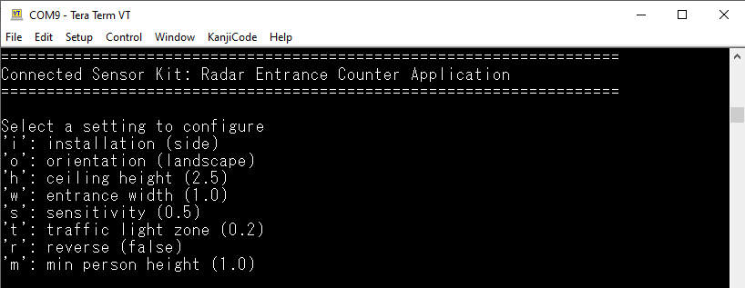

# Connected sensor kit: Radar entrance counter application

## Overview

This code example demonstrates a radar entrance counter application on FreeRTOS using [Infineon XENSIV™ 60-GHz radar MMIC](https://www.infineon.com/cms/en/product/sensor/radar-sensors/radar-sensors-for-iot/60ghz-radar/) that counts the number of people entering and exiting premises such as supermarkets, pharmacies, and office buildings. It helps business owners to determine the occupancy of their premises, enabling various solutions such as maintaining social distancing inside premises, evacuation during an emergency, and saving energy based on occupancy.

The entrance counting data can be sent to a centralized server; therefore, many sensors can be interconnected. In addition, the statistics collected by the central server can be displayed remotely on a laptop or mobile devices to understand the occupancy level of the facility.

[View this README on GitHub.](https://github.com/Infineon/mtb-example-sensors-radar-entrancecounter)

[Provide feedback on this code example.](https://cypress.co1.qualtrics.com/jfe/form/SV_1NTns53sK2yiljn?Q_EED=eyJVbmlxdWUgRG9jIElkIjoiQ0UyMzI2MjUiLCJTcGVjIE51bWJlciI6IjAwMi0zMjYyNSIsIkRvYyBUaXRsZSI6IkNvbm5lY3RlZCBzZW5zb3Iga2l0OiBSYWRhciBlbnRyYW5jZSBjb3VudGVyIGFwcGxpY2F0aW9uIiwicmlkIjoid3V5YW5nIiwiRG9jIHZlcnNpb24iOiIxLjAuMCIsIkRvYyBMYW5ndWFnZSI6IkVuZ2xpc2giLCJEb2MgRGl2aXNpb24iOiJNQ0QiLCJEb2MgQlUiOiJTQlNZUyIsIkRvYyBGYW1pbHkiOiJTVUJTWVMifQ==)


## Features

- Real-time count of the number of people entering and/or exiting a premises
- High-accuracy, low-latency counting
- Bidirectional counting – one sensor per entrance
- Ability to configure counter parameters via UART
- Field of View – Azimuth: +-45&deg;, Elevation: +-40&deg;

## Requirements

- [ModusToolbox&trade; software](https://www.cypress.com/products/modustoolbox-software-environment) v2.2

    **Note:** This code example version requires ModusToolbox&trade;  software version 2.2 or later and is not backward compatible with v2.1 or older versions.

- Board support package (BSP) minimum required version: 2.0.0
- Programming language: C
- Associated parts: All [PSoC&trade; 6 MCU](http://www.cypress.com/PSoC6) parts

## Supported toolchains (make variable 'TOOLCHAIN')

- GNU Arm® embedded compiler v9.3.1 (`GCC_ARM`) – Default value of `TOOLCHAIN`

## Supported kits (make variable 'TARGET')

- Rapid IoT connect developer kit (`CYSBSYSKIT-DEV-01`) – Default value of `TARGET`

## Hardware setup

This code example requires the XENSIV™ BGT60TR13C radar wing board as part of the connected sensor kit.

1. Connect the radar wing board to the CYSBSYSKIT-DEV-01 kit through the pin headers.

2. Connect the CYSBSYSKIT-DEV-01 kit to the PC with a USB cable.

3. Place the CYSBSYSKIT-DEV-01 kit at an entrance/exit location such as the side or ceiling of a door.

## Software setup

Install a terminal emulator if you don't have one. Instructions in this document use [Tera Term](https://ttssh2.osdn.jp/index.html.en).

This example requires no additional software or tools.


## Using the code example

Create the project and open it using one of the following:

<details><summary><b>In Eclipse IDE for ModusToolbox&trade; software</b></summary>

1. Click the **New application** link in the **quick panel** (or, use **File** > **New** > **ModusToolbox&trade; application**). This launches the [project creator](https://www.cypress.com/ModusToolboxProjectCreator) tool.

2. Select the CYSBSYSKIT-DEV-01 kit shown in the **Project creator - Choose board support package (BSP)** dialog.

3. In the **Project creator - Select application** dialog, choose the example "Radar_Entrance_Counter_Application_on_FreeRTOS" by enabling the checkbox.

4. (Optional) Change the suggested **New application name**.

5. The **Application(s) Root Path** defaults to the Eclipse workspace which is usually the desired location for the application. If you want to store the application in a different location, you can change the *Application(s) Root Path* value. Applications that share libraries should be in the same root path.

6. Click **Create** to complete the application creation process.

For more details, see the [Eclipse IDE for ModusToolbox&trade; software user guide](https://www.cypress.com/MTBEclipseIDEUserGuide) (locally available at *{ModusToolbox&trade; software install directory}/ide_{version}/docs/mt_ide_user_guide.pdf*).

</details>

<details><summary><b>In command-line interface (CLI)</b></summary>

ModusToolbox&trade; software provides the project creator as both a GUI tool and the command line tool, "project-creator-cli". The CLI tool can be used to create applications from a CLI terminal or from within batch files or shell scripts. This tool is available in the *{ModusToolbox&trade; software install directory}/tools_{version}/project-creator/* directory.

Use a CLI terminal to invoke the "project-creator-cli" tool. On Windows, use the command line "modus-shell" program provided in the ModusToolbox&trade; software installation instead of a standard Windows command-line application. This shell provides access to all ModusToolbox&trade; software tools. You can access it by typing `modus-shell` in the search box in the Windows menu. In Linux and macOS, you can use any terminal application.

This tool has the following arguments:

Argument | Description | Required/optional
---------|-------------|-----------
`--board-id` | Defined in the `<id>` field of the [BSP](https://github.com/Infineon?q=bsp-manifest&type=&language=&sort=) manifest | Required
`--app-id`   | Defined in the `<id>` field of the [CE](https://github.com/Infineon?q=ce-manifest&type=&language=&sort=) manifest | Required
`--target-dir`| Specify the directory in which the application is to be created if you prefer not to use the default current working directory | Optional
`--user-app-name`| Specify the name of the application if you prefer to have a name other than the example's default name | Optional

<br>

The following example will clone the "[Hello world](https://github.com/Infineon/mtb-example-psoc6-hello-world)" application with the desired name "MyHelloWorld" configured for the *CY8CKIT-062-WIFI-BT* BSP into the specified working directory, *C:/mtb_projects*:

   ```
   project-creator-cli --board-id CY8CKIT-062-WIFI-BT --app-id mtb-example-psoc6-hello-world --user-app-name MyHelloWorld --target-dir "C:/mtb_projects"
   ```

**Note:** The project-creator-cli tool uses the `git clone` and `make getlibs` commands to fetch the repository and import the required libraries. For details, see the "Project creator tools" section of the [ModusToolbox&trade; software user guide](https://www.cypress.com/ModusToolboxUserGuide) (locally available at *{ModusToolbox&trade; software install directory}/docs_{version}/mtb_user_guide.pdf*).

</details>

<details><summary><b>In third-party IDEs</b></summary>

Use one of the following options:

- **Use the standalone [project creator](https://www.cypress.com/ModusToolboxProjectCreator) tool:**

   1. Launch the project creator from the Windows Start menu or from *{ModusToolbox&trade; software install directory}/tools_{version}/project-creator/project-creator.exe*.

   2. In the initial **Choose board support package** screen, select the BSP, and click **Next**.

   3. In the **Select application** screen, select the appropriate IDE from the **Target IDE** drop-down menu.

   4. Click **Create** and follow the instructions printed in the bottom pane to import or open the exported project in the respective IDE.

<br>

- **Use command-line interface (CLI):**

   1. Follow the instructions from the **In command-line interface (CLI)** section to create the application, and then import the libraries using the `make getlibs` command.

   2. Export the application to a supported IDE using the `make <ide>` command.

   3. Follow the instructions displayed in the terminal to create or import the application as an IDE project.

For a list of supported IDEs and more details, see the "Exporting to IDEs" section of the [ModusToolbox&trade; software user guide](https://www.cypress.com/ModusToolboxUserGuide) (locally available at *{ModusToolbox&trade; software install directory}/docs_{version}/mtb_user_guide.pdf*).

</details>


## Operation

1. Connect the CYSBSYSKIT-DEV-01 kit with the radar wing board to the PC.

2. Open a terminal program and select the KitProg3 COM port. Set the serial port parameters to 8N1 and 115200 baud.

3. Program the board using one of the following:

   <details><summary><b>Using Eclipse IDE for ModusToolbox&trade; software</b></summary>

     1. Select the application project in the project explorer.

     2. In the **quick panel**, scroll down, and click **\<Application name> Program (KitProg3_MiniProg4)**.

    </details>

    <details><summary><b>Using CLI</b></summary>

     From the terminal, execute the `make program` command to build and program the application using the default toolchain to the default target. The default toolchain and target are specified in the application's Makefile but you can override those values manually:

     ```
     make program TARGET=<BSP> TOOLCHAIN=<toolchain>
     ```

     Example:

     ```
     make program TARGET=CYSBSYSKIT-DEV-01 TOOLCHAIN=GCC_ARM
     ```

    </details>

4. After programming, the application starts automatically. Confirm that "Connected sensor kit: Radar entrance counter application on FreeRTOS" along with a list of configurable parameters is displayed on the UART terminal.

   **Figure 1. Terminal output on program startup**

   

    Counter events are displayed on the terminal along with their timestamps in milliseconds. When a person makes an entry after passing through the radar field of view, the IN count is incremented. The 'occupied' information is displayed for the time the person remains in the field of view. Similarly, when a person makes an exit, the OUT count is incremented. The counter free information is displayed when the field of view is clear.

### Sensor Information and LEDs
1. The radar task is suspended if the radar wing board is not connected to the feather kit. The sensor initialization process is indicated by blinking the red LED (CYBSP_USER_LED) on CYSBSYSKIT-DEV-01. The red LED (CYBSP_USER_LED) on CYSBSYSKIT-DEV-01 remains turned on when system is operational (ready state).

2. The LED on radar wing board indicates different events with different patterns as follows:

    **Table 1. Events and LED glow patterns**

   | LED pattern  |  Event type  |  Comment  |
   | ----------- | ----------- | -----    |
   | **Entrance counter** |
   | LED glows in red color | `MTB_RADAR_SENSING_EVENT_COUNTER_OCCUPIED` | Counter event detected. Entering field of view
   | LED glows in green color | `MTB_RADAR_SENSING_EVENT_COUNTER_FREE` |Counter event detected. Leaving field of view
   | LED blinking in red/green color | `MTB_RADAR_SENSING_EVENT_COUNTER_IN` or `MTB_RADAR_SENSING_EVENT_COUNTER_OUT` | Depends on the installation position to determine which scenario is **IN**, which is **OUT** |

### Configure parameters

You can configure the application parameters by pressing the appropriate keys as displayed on the terminal.

- Radar counter installation

  - Location where the radar is mounted on an entrance/exit

  - Supported values: "ceiling", "side"

  - Default value: "side"

- Radar counter orientation

  - Orientation of the radar

  - Supported values: "landscape", "portrait"

  - Default value: "portrait"

- Radar counter ceiling height

  - Height of the ceiling in meters (effective only with a ceiling installation)

  - Supported values: 0-3 m

  - Default value: 2.5 m

- Radar counter entrance width

  - Width of the entrance where the radar is mounted

  - Supported values: 0-3 m

  - Default value: 1 m

- Radar counter sensitivity

  - Sensitivity for the counter

  - Supported values: 0-1 (0: lowest, 1: highest)

  - Default value: 0.5 (medium)

- Radar counter traffic light zone

  - Width of a rectangular zone in front of the radar where a target presence/absence is detected

  - Supported values: 0-1 m

  - Default value: 1 m

- Radar counter reverser

  - Directionality of the counter

  - Supported values: "true" (entrance as IN, exit as OUT), "false" (entrance as OUT, exit as IN)

  - Default value: "false"

- Radar counter minimum person height

  - Minimum height of a person that needs to be considered for counting (effective only for ceiling installation).

  - Supported values: 0-2 m

  - Default value: 1 m

For details, see the [XENSIV™ RadarSensing API documentation](https://infineon.github.io/xensiv-radar-sensing/radarsensing_api_reference_manual/html/index.html).


## Debugging

You can debug the example to step through the code. In the IDE, use the **\<Application name> Debug (KitProg3_MiniProg4)** configuration in the **quick panel**. For more details, see the "Program and debug" section in the [Eclipse IDE for ModusToolbox&trade; software user guide](https://www.cypress.com/MTBEclipseIDEUserGuide).

**Note:** **(Only while debugging)** On the CM4 CPU, some code in `main()` may execute before the debugger halts at the beginning of `main()`. This means that some code executes twice – once before the debugger stops execution, and again after the debugger resets the program counter to the beginning of `main()`. See [KBA231071](https://community.cypress.com/docs/DOC-21143) to learn about this and for the workaround.


## Design and implementation

### Resources and settings

**Table 1. Application source files**

|**File name**            |**Comments**         |
| ------------------------|-------------------- |
| *main.c* |Contains the application entry point. It initializes the UART for debugging and then initializes the controller tasks|
| *radar_counter_task.c* |Contains the task function for the entrance counter application, as well as the callback function|
| *radar_counter_terminal_ui.c* |Contains the task function for the terminal UI |
| *radar_led_task.c* |Contains the task function that handles the LEDs |

<br>

**Table 2. Functions in *main.c***

| **Function name** | **Functionality** |
| ------------------------|-------------------- |
| `main` | Main function for the CM4 CPU. It does the following:<br>1. Initializes the BSP<br>2. Enables global interrupt<br>3. Initializes Retarget IO<br>4. Creates the radar entrance counter, terminal, and LED tasks<br>5. Starts the scheduler |

<br>

**Table 3. Functions in *radar_counter_task.c***

| **Function name** | **Functionality** |
| ------------------------|-------------------- |
| `radar_counter_callback` | Updates the LEDs and handles radar events |
| `radar_counter_task` | Initializes the RadarSensing module and starts the processing loop |
| `radar_counter_task_set_mute` | Enables/disables terminal output from the radar counter task |

<br>

**Table 4. Functions in *radar_counter_terminal_ui.c***

| **Function name** | **Functionality** |
| ------------------------|-------------------- |
| `terminal_ui_menu` | Prints the configuration menu |
| `terminal_ui_info` | Prints the help info |
| `terminal_ui_readline` | Gets the user input from the terminal |
| `terminal_ui_print_result` | Prints the return value of a parameter configuration function call |
| `radar_counter_terminal_ui` | Starts the terminal UI task loop |

<br>

**Table 5. Functions in *radar_led_task.c***

| **Function name** | **Functionality** |
| ------------------------|-------------------- |
| `gpio_led_set` | Uses the GPIO pins to activate the LEDs set by the user |
| `radar_led_set_pattern` | Sets the LED blinking pattern for entrance counter events |
| `radar_led_task` | Initializes parameters for the LED blinking pattern |

<br>

**Table 6. Application resources**

| Resource  |  Alias/object     |    Purpose     |
| :-------- | :-------------    | :------------- |
| UART (HAL) | cy_retarget_io_uart_obj | UART HAL object used by Retarget IO for Debug UART port |
| GPIO (HAL) | LED_RGB_RED      | User LED to indicate the doorway state |
| GPIO (HAL) | LED_RGB_GREEN    | Wing Board LED to indicate the doorway state |
| SPI | mSPI | Communication with the radar hardware |

The application uses a UART resource from the [hardware abstraction layer](https://github.com/Infineon/psoc6hal) (HAL) to print messages in a UART terminal emulator. The UART resource initialization and retargeting of standard I/O to the UART port is done using the [retarget-io](https://github.com/Infineon/retarget-io) library. After using `cy_retarget_io_init`, messages can be printed on the terminal by simply using `printf` commands.

The LEDs on the radar wing board are used to show whether the doorway being monitored by the device is occupied or free, as well as what kind of event was just detected. This is handled by the LED task.

In the terminal task, `cyhal_uart_getc`, `cyhal_uart_putc`, and `printf` are used to display a textual menu to the user, get the user input, and display feedback.

In the radar counter task, the SPI bus is used for communication with the radar hardware.


## Related resources

Resources  | Links
-----------|----------------------------------
Application notes  |[AN228571](https://www.cypress.com/AN228571) – Getting started with PSoC&trade; 6 MCU on ModusToolbox&trade; software
Code examples  | [Using ModusToolbox&trade; software](https://github.com/Infineon/Code-Examples-for-ModusToolbox-Software) on GitHub
Device documentation | [PSoC&trade; 6 MCU datasheets](https://www.cypress.com/search/all?f[0]=meta_type%3Atechnical_documents&f[1]=resource_meta_type%3A575&f[2]=field_related_products%3A114026) <br> [PSoC&trade; 6 technical reference manuals](https://www.cypress.com/search/all/PSoC%206%20Technical%20Reference%20Manual?f[0]=meta_type%3Atechnical_documents&f[1]=resource_meta_type%3A583)
Development kits | [Connected sensor kit](https://www.infineon.com/connectedsensorkit) <br> CYSBSYSKIT-DEV-01 rapid IoT connect developer kit
Libraries on GitHub  | [mtb-pdl-cat1](https://github.com/infineon/mtb-pdl-cat1) – PSoC&trade; 6 peripheral driver library (PDL)  <br> [mtb-hal-cat1](https://github.com/infineon/mtb-hal-cat1) – Hardware abstraction layer (HAL) library <br> [retarget-io](https://github.com/infineon/retarget-io) – Utility library to retarget STDIO messages to a UART port<br> [xensiv-radar-sensing](https://github.com/Infineon/xensiv-radar-sensing) – RadarSensing library API to detect the presence and count people using the XENSIV™ BGT60TR13C radar wing board
Middleware on GitHub  | [psoc6-middleware](https://github.com/Infineon/modustoolbox-software#psoc-6-middleware-libraries) – Links to all PSoC&trade; 6 MCU middleware
Tools  | [Eclipse IDE for ModusToolbox&trade; software](https://www.cypress.com/modustoolbox) – ModusToolbox&trade; software is a collection of easy-to-use software and tools enabling rapid development with Infineon MCUs, covering applications from embedded sense and control to wireless and cloud-connected systems using AIROC&trade; Wi-Fi and Bluetooth® connectivity devices.


## Other resources

Cypress provides a wealth of data at www.cypress.com to help you select the right device, and quickly and effectively integrate it into your design.

For PSoC™ 6 MCU devices, see [How to design with PSoC™ 6 MCU - KBA223067](https://community.cypress.com/docs/DOC-14644) in the Cypress community.

## Document history

Document title: *CE232625* – *Connected sensor kit: Radar entrance counter application on FreeRTOS*

| Version | Description of change |
| ------- | --------------------- |
| 0.5.0   | New code example      |
| 1.0.0   | Update to: <br>1. Support xensiv-radar-sensing v1.X library <br>2. Reduce drive strength to improve EMI      |
------

All other trademarks or registered trademarks referenced herein are the property of their respective owners.

---------

© Cypress Semiconductor Corporation (An Infineon Technologies Company), 2021. This document is the property of Cypress Semiconductor Corporation and its affiliates ("Cypress"). This document, including any software or firmware included or referenced in this document ("Software"), is owned by Cypress under the intellectual property laws and treaties of the United States and other countries worldwide. Cypress reserves all rights under such laws and treaties and does not, except as specifically stated in this paragraph, grant any license under its patents, copyrights, trademarks, or other intellectual property rights. If the Software is not accompanied by a license agreement and you do not otherwise have a written agreement with Cypress governing the use of the Software, then Cypress hereby grants you a personal, non-exclusive, nontransferable license (without the right to sublicense) (1) under its copyright rights in the Software (a) for Software provided in source code form, to modify and reproduce the Software solely for use with Cypress hardware products, only internally within your organization, and (b) to distribute the Software in binary code form externally to end users (either directly or indirectly through resellers and distributors), solely for use on Cypress hardware product units, and (2) under those claims of Cypress's patents that are infringed by the Software (as provided by Cypress, unmodified) to make, use, distribute, and import the Software solely for use with Cypress hardware products. Any other use, reproduction, modification, translation, or compilation of the Software is prohibited.<br />
TO THE EXTENT PERMITTED BY APPLICABLE LAW, CYPRESS MAKES NO WARRANTY OF ANY KIND, EXPRESS OR IMPLIED, WITH REGARD TO THIS DOCUMENT OR ANY SOFTWARE OR ACCOMPANYING HARDWARE, INCLUDING, BUT NOT LIMITED TO, THE IMPLIED WARRANTIES OF MERCHANTABILITY AND FITNESS FOR A PARTICULAR PURPOSE. No computing device can be absolutely secure. Therefore, despite security measures implemented in Cypress hardware or software products, Cypress shall have no liability arising out of any security breach, such as unauthorized access to or use of a Cypress product. CYPRESS DOES NOT REPRESENT, WARRANT, OR GUARANTEE THAT CYPRESS PRODUCTS, OR SYSTEMS CREATED USING CYPRESS PRODUCTS, WILL BE FREE FROM CORRUPTION, ATTACK, VIRUSES, INTERFERENCE, HACKING, DATA LOSS OR THEFT, OR OTHER SECURITY INTRUSION (collectively, "Security Breach"). Cypress disclaims any liability relating to any Security Breach, and you shall and hereby do release Cypress from any claim, damage, or other liability arising from any Security Breach. In addition, the products described in these materials may contain design defects or errors known as errata which may cause the product to deviate from published specifications. To the extent permitted by applicable law, Cypress reserves the right to make changes to this document without further notice. Cypress does not assume any liability arising out of the application or use of any product or circuit described in this document. Any information provided in this document, including any sample design information or programming code, is provided only for reference purposes. It is the responsibility of the user of this document to properly design, program, and test the functionality and safety of any application made of this information and any resulting product. "High-Risk Device" means any device or system whose failure could cause personal injury, death, or property damage. Examples of High-Risk Devices are weapons, nuclear installations, surgical implants, and other medical devices. "Critical Component" means any component of a High-Risk Device whose failure to perform can be reasonably expected to cause, directly or indirectly, the failure of the High-Risk Device, or to affect its safety or effectiveness. Cypress is not liable, in whole or in part, and you shall and hereby do release Cypress from any claim, damage, or other liability arising from any use of a Cypress product as a Critical Component in a High-Risk Device. You shall indemnify and hold Cypress, its directors, officers, employees, agents, affiliates, distributors, and assigns harmless from and against all claims, costs, damages, and expenses, arising out of any claim, including claims for product liability, personal injury or death, or property damage arising from any use of a Cypress product as a Critical Component in a High-Risk Device. Cypress products are not intended or authorized for use as a Critical Component in any High-Risk Device except to the limited extent that (i) Cypress's published data sheet for the product explicitly states Cypress has qualified the product for use in a specific High-Risk Device, or (ii) Cypress has given you advance written authorization to use the product as a Critical Component in the specific High-Risk Device and you have signed a separate indemnification agreement.<br />
Cypress, the Cypress logo, Spansion, the Spansion logo, and combinations thereof, WICED, PSoC™, CapSense, EZ-USB, F-RAM, and Traveo are trademarks or registered trademarks of Cypress in the United States and other countries. For a more complete list of Cypress trademarks, visit cypress.com. Other names and brands may be claimed as property of their respective owners.
